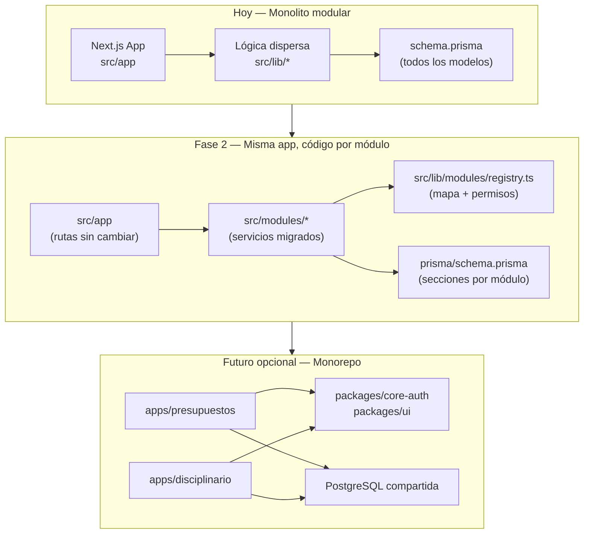
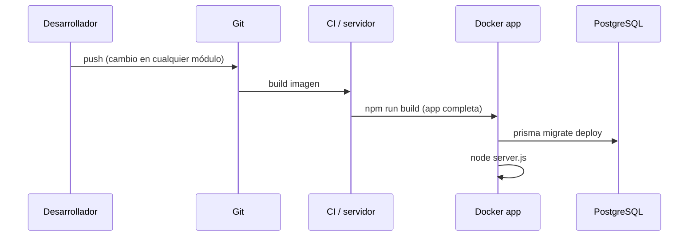
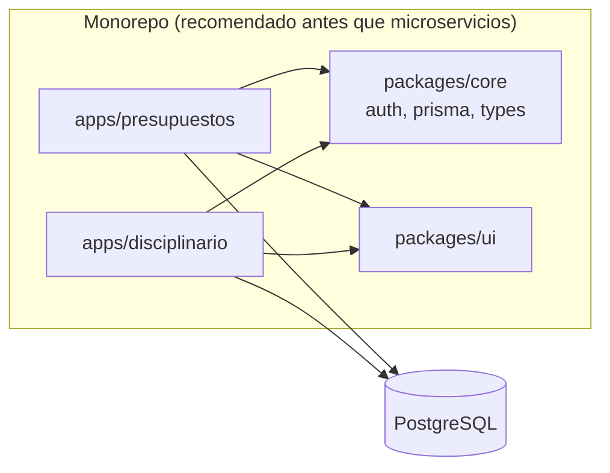

# Arquitectura modular — Alfa One

Este documento define **cómo está organizado el proyecto hoy**, **cómo evolucionar sin romper despliegues** y **cuándo separar apps** si un módulo necesita releases independientes.

---

## 1. Visión

Una **plataforma multiempresa** con módulos de negocio que comparten:

- Autenticación (NextAuth + JWT)
- Catálogo de empresas (`Company`)
- UI base (layout, sidebar, componentes `components/ui`)
- Base de datos PostgreSQL (un esquema Prisma, fronteras por dominio)

Los módulos **se integran en runtime** (misma app, misma sesión). No hay microservicios en esta fase.

---

## 2. Estado actual vs objetivo



| Capa | Ubicación actual | Objetivo Fase 2 |
|------|------------------|-----------------|
| Rutas UI | `src/app/(app)/…` | Sin cambiar URLs |
| API | `src/app/api/…` | Sin cambiar paths |
| UI por dominio | `src/components/contracts`, `disciplinary`, … | Mantener; opcional alias `@/modules/...` más adelante |
| Lógica servidor | `src/lib/server/*`, `src/lib/business/*` | Mover gradualmente a `src/modules/<id>/` |
| Permisos | `src/lib/permissions.ts` | + `src/lib/modules/access.ts` |
| Mapa del sistema | — | `src/lib/modules/registry.ts` |

---

## 3. Módulos de negocio

| ID | Nombre | Rutas UI principales | Prefijos API | Modelos Prisma (referencia) |
|----|--------|----------------------|--------------|-----------------------------|
| `core` | Núcleo | `/dashboard`, `/login` | `/api/auth`, `/api/companies`, `/api/branding` | `Company`, `User`, `Account`, `Session` |
| `presupuestos` | Presupuestos y contratos | `/contracts`, `/expenses`, `/expenses/pending-approvals`, `/expenses/approval-bitacora` | `/api/contracts`, `/api/expenses`, `/api/import`, `/api/positions` | `Contract`, `Expense`, `ContractPeriod`, … |
| `reportes` | Reportes | `/reports`, `/reports/annual` | `/api/reports` | (consultas sobre contratos/gastos) |
| `inventario` | Inventario | `/inventory` | `/api/assets`, `/api/asset-movements` | `Asset`, `AssetType`, `AssetMovement` |
| `disciplinario` | Procesos disciplinarios | `/disciplinario/*` | `/api/disciplinary`, `/api/admin/disciplinary` | `Disciplinary*` |
| `plataforma` | Administración | `/admin/users`, `/admin/catalogs` | `/api/admin`, `/api/users` | Catálogos, `AppBranding`, `AppDisciplinarySettings` |

**Regla de acoplamiento en BD:** los módulos no deben tener FK entre tablas de dominios distintos (ej. `Disciplinary*` → `Asset`). El cruce permitido es vía `Company`, `User`, `Contract` (cuando el negocio lo exige, como apercibimiento ↔ contrato).

---

## 4. Capas dentro de cada módulo (convención Fase 2)

```
src/modules/<modulo>/
  README.md          # Qué vive aquí y qué sigue en lib/ (hasta migrar)
  services/          # Orquestación, PDFs, imports (desde lib/server)
  business/          # Reglas puras (desde lib/business)
  validations/       # Zod (desde lib/validations)
```

**Orden de migración recomendado** (cambios pequeños, PRs revisables):

1. `disciplinario` — ya concentrado en `lib/server/disciplinary-*`
2. `inventario` — `assets`, movimientos
3. `presupuestos` — el volumen mayor (`contracts`, `expenses`)
4. `plataforma` — admin y catálogos

No mover archivos en bloque: un servicio o validación por PR, actualizar imports `@/lib/...` → `@/modules/...`.

---

## 5. Despliegue hoy y optimización de cambios



### Qué implica hoy

- **Un `npm run build` compila todos los módulos.** Es normal en un monolito.
- **Un despliegue actualiza toda la app.** La ganancia de la estructura modular no es “deploy parcial” aún, sino:
  - Saber qué carpetas tocar para un bug de disciplinario
  - Revisar PRs por dominio
  - Preparar extracción a monorepo sin reescribir

### Prácticas para cambios seguros

| Práctica | Detalle |
|----------|---------|
| Migraciones Prisma | Siempre en `prisma/migrations/`; en producción solo `migrate deploy` (ya en `Dockerfile`) |
| Cambios solo disciplinario | Tocar `src/app/**/disciplinario`, `api/disciplinary`, `lib/server/disciplinary-*`, sección Prisma disciplinario |
| Cambios solo presupuestos | `contracts`, `expenses`, `api/contracts`, `api/expenses`, modelos Contract/Expense |
| No acoplar dominios en Prisma | Nuevas tablas del módulo X referencian `Company` / `User`, no tablas de Y |
| Permisos | [`src/lib/permissions/registry.ts`](../src/lib/permissions/registry.ts) + [`docs/PERMISSIONS.md`](./PERMISSIONS.md); roles en BD (`Role`, `RolePermission`) |

### CI (GitHub Actions)

Implementado en [`.github/workflows/ci.yml`](../.github/workflows/ci.yml):

- **Path filters** por módulo (tabla en el job summary del PR).
- **Lint + build** cuando cambia `src/`, `prisma/` o dependencias.
- Patrones: [`scripts/ci/module-paths.json`](../scripts/ci/module-paths.json) — ver [`docs/CI.md`](./CI.md).

Local: `npm run ci:modules`.

El deploy sigue siendo **una app**; el CI no sustituye el build completo del monolito.

---

## 6. Camino a despliegues independientes (opcional)

Solo si el negocio exige publicar **solo presupuestos** sin redesplegar disciplinario:



- Misma BD, migraciones coordinadas (un paquete `packages/database`).
- SSO: mismo `NEXTAUTH_SECRET` y dominio con rutas `/presupuestos`, `/disciplinario` o subdominios.
- Fase 2 estable: ver [`docs/MONOREPO-ROADMAP.md`](./MONOREPO-ROADMAP.md) para el plan de extracción a Turborepo.

---

## 7. Multiempresa

- `User.company` → FK `Company.code`
- Datos de negocio filtrados por `company` en queries (contratos, gastos, etc.)
- Sesión JWT incluye `company`; APIs deben validar coherencia con `requireCompanyCode` donde aplique

---

## 8. Herramientas (Warp, Cursor, OpenCode)

| Herramienta | Uso en este proyecto |
|-------------|----------------------|
| **Warp** | Docker, `npm run db:*`, scripts de servidor |
| **Cursor** | Refactors por módulo, Prisma, UI; contexto: `docs/ARCHITECTURE.md` |
| **OpenCode / CI** | `docker compose`, Render; extender `Dockerfile` / compose, no duplicar stack |

---

## 9. Checklist antes de un cambio

- [ ] ¿En qué módulo está el cambio? (ver `src/lib/modules/registry.ts`)
- [ ] ¿Afecta Prisma? → migración nombrada y reversible
- [ ] ¿Nueva ruta API? → `withAuth` + permiso en `permissions.ts` o `access.ts`
- [ ] ¿Nuevo ítem en sidebar? → `src/lib/modules/navigation.ts` + `moduleId`
- [ ] ¿Cruza otro dominio? → solo vía `Company` / `User` / contrato acordado

---

## 10. Referencias en el repo

- Mapa ejecutable: [`src/lib/modules/registry.ts`](../src/lib/modules/registry.ts)
- Navegación y permisos UI: [`src/lib/modules/navigation.ts`](../src/lib/modules/navigation.ts), [`access.ts`](../src/lib/modules/access.ts)
- Despliegue: [`DEPLOYMENT.md`](./DEPLOYMENT.md)
- Por módulo: [`src/modules/README.md`](../src/modules/README.md)
- Desarrollo local: [`LOCAL-DEV.md`](./LOCAL-DEV.md)
