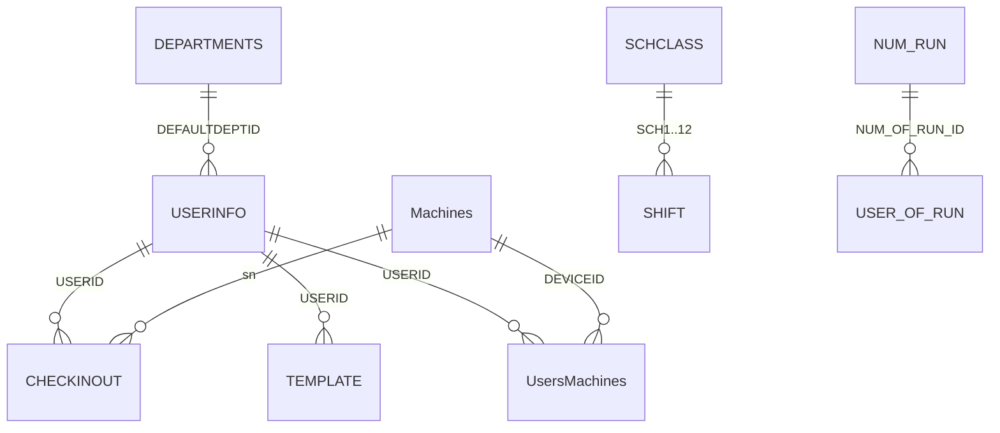

# DATABASE.md — ATT2016 (inspección confirmada)

> **Fecha de introspección:** 2026-08-18  
> **Modo:** solo lectura (copia temporal analizada, sin modificar el archivo en producción)  
> **Estado:** mapa confirmado desde `ATT2016.MDB` activo

---

## 1. Ubicación real

| Concepto | Valor |
|----------|--------|
| Servidor SMB | `10.1.1.3` |
| Share | `DB-Biometrico` (no hay subcarpeta `ATT2016`) |
| Ruta UNC | `\\10.1.1.3\DB-Biometrico` |
| Base activa | **`ATT2016.MDB`** (~26 MB, actualizada 2026-08-18) |
| Formato | **Microsoft Access (Jet/ACE)** — ZKTeco Attendance Management |
| Lock/backup | `att2016 - Backup.mdb`, múltiples `Copia de seguridad (*).mdb`, `.ldb` |

### Credenciales

Configurar **solo** en variables de entorno (nunca en código ni en git):

```bash
ATT2016_SMB_SHARE=//10.1.1.3/DB-Biometrico
ATT2016_SMB_USER=SoporteTI01
ATT2016_SMB_PASSWORD=<secreto>
ATT2016_DATABASE_FILE=ATT2016.MDB
```

Usuario SMB válido confirmado: **`SoporteTI01`** (sin dominio).

---

## 2. Parámetros del sistema (`ATTPARAM`)

| Parámetro | Valor | Significado |
|-----------|-------|-------------|
| `DBVERSION` | **379** | Versión esquema ZKTeco |
| `MinsEarly` | 5 | Salida anticipada (min) |
| `MinsLate` | 10 | Llegada tardía (min) |
| `MinsWorkDay` | 420 | Jornada mínima (7 h) |
| `TwoDay` | 0 | Turno no cruza medianoche por defecto |

Total filas en `ATTPARAM`: **53**

---

## 3. Inventario de tablas (43)

### Núcleo operativo

| Tabla | Filas | Rol |
|-------|------:|-----|
| **`USERINFO`** | **141** | Empleados |
| **`CHECKINOUT`** | **334.633** | Marcas de asistencia |
| **`DEPARTMENTS`** | **1** | Departamentos |
| **`Machines`** | **4** | Dispositivos biométricos |
| **`TEMPLATE`** | **0** | Huellas dactilares (blob) |
| **`FaceTemp`** | **0** | Plantillas faciales |
| **`UsersMachines`** | **0** | Empleado ↔ dispositivo |
| **`AUTHDEVICE`** | **0** | Autorización por dispositivo |

### Turnos y horarios

| Tabla | Filas | Rol |
|-------|------:|-----|
| **`SCHCLASS`** | **0** | Clases de horario (entrada/salida/tolerancias) |
| **`SHIFT`** | **0** | Turnos compuestos |
| **`NUM_RUN`** | **0** | Turnos rotativos |
| **`NUM_RUN_DEIL`** | **0** | Detalle turno rotativo |
| **`USER_OF_RUN`** | **0** | Asignación empleado ↔ turno rotativo |
| **`USER_TEMP_SCH`** | **0** | Horarios temporales |
| **`USER_SPEDAY`** | **0** | Días especiales / permisos |
| **`HOLIDAYS`** | — | Feriados |
| **`LEAVECLASS` / `LEAVECLASS1`** | — | Tipos de permiso / incidencias |

### Auditoría y ajustes

| Tabla | Rol |
|-------|-----|
| **`CHECKEXACT`** | Marcas ajustadas manualmente |
| **`EXCNOTES`** | Notas por fecha |
| **`AuditedExc`** | Excepciones auditadas |
| **`EmOpLog`** | Log operaciones empleado |
| **`ServerLog` / `SystemLog` / `AlarmLog`** | Logs sistema y alarmas |

### Control de acceso (extensiones)

`ACGroup`, `ACTimeZones`, `UserACMachines`, `UserACPrivilege`, etc.

---

## 4. Tablas clave — campos importantes

### `USERINFO` (empleados)

| Campo | Tipo | Notas |
|-------|------|-------|
| **`USERID`** | Long Integer | ID interno (**1 … 141**, secuencial) |
| **`Badgenumber`** | Text(24) | **Código visible en reloj** (ej. `20508`, `85773`) — **único** |
| **`Name`** | Text(40) | Nombre |
| **`SSN`** | Text(20) | En esta instalación repite el badge en varios registros |
| **`DEFAULTDEPTID`** | Integer | FK → `DEPARTMENTS.DEPTID` |
| **`ATT`, `INLATE`, `OUTEARLY`, `OVERTIME`** | Integer | Flags reglas asistencia |
| **`PASSWORD`, `CardNo`** | Text | Credenciales tarjeta/dispositivo |
| **`PHOTO`, `Notes`** | OLE | Foto/notas |

**PK:** `USERID` (no es IDENTITY en el export; en la práctica es secuencia 1..N)

### `CHECKINOUT` (marcas)

| Campo | Tipo | Notas |
|-------|------|-------|
| **`USERID`** | Long Integer | FK → `USERINFO.USERID` |
| **`CHECKTIME`** | DateTime | Timestamp marca |
| **`CHECKTYPE`** | Text(1) | Tipo (I/O, etc.) |
| **`VERIFYCODE`** | Long Integer | 1=password, 2=fingerprint, 3=card… |
| **`SENSORID`** | Text(5) | Sensor/dispositivo |
| **`WorkCode`** | Long Integer | Código trabajo |
| **`sn`** | Text(20) | Serial del reloj |

**PK compuesta:** `(USERID, CHECKTIME)`

### `DEPARTMENTS`

| Campo | Notas |
|-------|-------|
| `DEPTID` | PK |
| `DEPTNAME` | Nombre |
| `SUPDEPTID` | Padre (0 = raíz) |

**Datos actuales:** un solo departamento raíz **"Esta Compañia"** (`DEPTID=1`).

### `Machines` (dispositivos)

| Campo | Notas |
|-------|-------|
| `ID` | PK interna |
| `MachineAlias` | Nombre |
| `IP` | Dirección IP |
| `Port` | **4370** (ZKTeco) |
| `sn` | Serial |
| `Enabled` | Activo |
| `usercount`, `fingercount` | Contadores cache |

**Dispositivos registrados (2026-08-18):**

| ID | Alias | IP | Puerto | Serial |
|----|-------|-----|--------|--------|
| 2 | Piso 01 | 10.1.1.80 | 4370 | 4224931360014 |
| 4 | Piso 02 | 10.1.1.81 | 4370 | 4227592020049 |
| 7 | Alajuela Comedor | 10.2.2.10 | 4370 | 0422143200067 |
| 13 | Centro Comecial WELL | 10.4.4.10 | 4370 | — |

### `TEMPLATE` (huellas)

| Campo | Notas |
|-------|-------|
| `USERID`, `FINGERID` | Dedos por empleado |
| `TEMPLATE`, `TEMPLATE1..4` | Blobs biométricos |

**Estado actual:** 0 registros (huellas pueden estar solo en dispositivos, no sincronizadas a la MDB).

---

## 5. Relaciones



---

## 6. Identificación de empleados (estrategia Finger System)

| Sistema | Identificador | Observación |
|---------|---------------|-------------|
| ATT2016 | `USERID` | Secuencial **1–141**; próximo libre ≈ **142** |
| ATT2016 | `Badgenumber` | Código operativo en reloj; **no coincide** con USERID |
| Alfa One | `employees.codigoEmpleado` | Candidato natural para mapear → `Badgenumber` |

### Reglas para alta de empleados (escritura futura)

1. **`USERID`** = `MAX(USERID) + 1` en transacción (nunca aleatorio).
2. **`Badgenumber`** = código RRHH acordado; validar unicidad antes de insertar.
3. No reutilizar `USERID` de empleados inactivos sin política explícita.
4. Mantener tabla puente `finger_employee_links` (`employeeId`, `attUserId`, `badgeNumber`).

---

## 7. Multiempresa

En esta MDB **no hay tabla de empresas separada**. Hay un solo departamento raíz.  
Multiempresa en Finger System deberá modelarse en PostgreSQL (`Company`) y mapearse vía departamentos, badges o convención interna — **validar con Planillas** si existen otras MDB o instalaciones.

---

## 8. Riesgos detectados

| Riesgo | Severidad | Mitigación |
|--------|-----------|------------|
| MDB abierta por Attendance Management (`.ldb`) | Media | Coordinar sync cuando software Windows no tenga la BD bloqueada |
| Archivo activo vs copias `.mdb` | Media | Siempre usar **`ATT2016.MDB`**; backups solo para restore |
| `TEMPLATE` vacío | Media | Sync de huellas desde dispositivos, no asumir BD |
| Turnos vacíos (`SCHCLASS`, `SHIFT`) | Alta | Configurar turnos en Finger System o importar cuando existan |
| Escritura concurrente | Alta | Modo lectura hasta pruebas; transacciones + backup previo |
| 334k+ marcas | Baja | Import incremental por rango de fechas |

---

## 9. Compatibilidad Attendance Management 2008/2016

Esquema **ZKTeco clásico** (`USERINFO`, `CHECKINOUT`, `Machines`, `SCHCLASS`, `ATTPARAM`, …) con extensiones de control de acceso (`ACGroup`, `FaceTemp`).  
Compatible con la arquitectura de adaptadores planificada en Finger System.

---

## 10. Próximos pasos técnicos (Fase 2)

1. Adaptador `Att2016MdbAdapter`: lectura vía SMB + copia temporal o ODBC (solo lectura).
2. Import incremental `CHECKINOUT` → cache PostgreSQL.
3. Mapeo `Badgenumber` ↔ `employees.codigoEmpleado`.
4. Sincronización dispositivos (`Machines` + ping TCP 4370).
